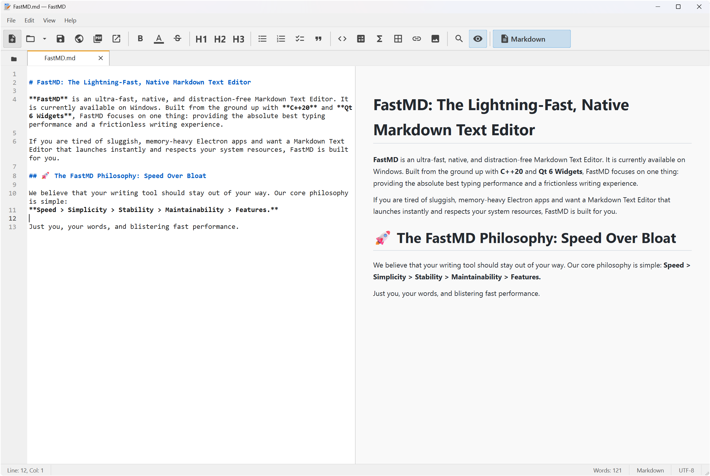

# FastMD: The Lightning-Fast, Native Markdown Editor

[](https://github.com/)
[](https://opensource.org/licenses/MIT)
[](https://microsoft.com/windows)



**FastMD** is an ultra-fast, native, and distraction-free Markdown editor. It is currently available on Windows. Built from the ground up with **C++20** and **Qt 6 Widgets**, FastMD focuses on one thing: providing the absolute best typing performance and a frictionless writing experience.

If you are tired of sluggish, memory-heavy Electron apps and want a Markdown editor that launches instantly and respects your system resources, FastMD is built for you.

## 🚀 The FastMD Philosophy: Speed Over Bloat

We believe that your writing tool should stay out of your way. Our core philosophy is simple:
**Speed > Simplicity > Stability > Maintainability > Features.**

To guarantee that typing performance remains inviolable, FastMD relies on strict architectural boundaries. **You will never see the following in FastMD:**

- ❌ Electron or Chromium-based WebEngines
- ❌ Heavy Database backends (SQLite)
- ❌ Bloated Project Explorers or Sidebars
- ❌ Cloud sync, AI features, or plugins

Just you, your words, and blistering fast performance.

## ✨ Key Features

### 🎯 Core Capabilities

- **Markdown Editor:** Full CommonMark support with syntax highlighting
- **Plain Text Mode:** Edit plain text files (.txt, .log, .csv, etc.) with dedicated mode
- **Live Preview:** Real-time Markdown preview side-by-side with editor
- **HTML & PDF Export:** Generate clean, self-contained HTML or beautifully formatted PDFs
- **Workspace Tree:** Browse and open files from your project folder
- **Session Restore:** Automatically restore previous session on startup
- **File Type Association:** Associate supported file types with FastMD
- **Check for Updates:** Stay up-to-date with built-in GitHub release checker
- **Preferences:** Customize editor behavior and startup settings

### 📊 By The Numbers (FastMD vs. Electron)

While standard Markdown editors rely on embedding an entire Chromium web browser and Node.js instance just to render text, FastMD goes straight to the metal. Here is a rough comparison of what that means for your system:

| Metric                   | Typical Electron Editor | FastMD (C++ / Qt)    | Difference    |
| ------------------------ | ----------------------- | -------------------- | ------------- |
| **Base Executable Size** | 100 MB – 150 MB         | **~1 MB**            | ~100x smaller |
| **Idle RAM Usage**       | 500 MB – 1000 MB        | **~50 MB**           | ~10x lighter  |
| **Cold Startup Time**    | 2.0s – 4.0s             | **< 0.1s** (Instant) | ~30x faster   |

_Numbers are approximate averages based on common Chromium-based desktop text editors._

### ⚡ Native Performance & Low Memory Footprint

By leveraging native **C++20** and the **Qt 6 Widgets** framework (rather than QML or Qt WebEngine), FastMD achieves near-instant startup times and consumes a fraction of the RAM required by modern browser-based editors.

### 📝 Blazing Fast Markdown Parsing

FastMD utilizes the [MD4C](https://github.com/mity/md4c) parser—a highly optimized, CommonMark-compliant C library. Whether you're opening a 10-line note or a 10,000-line manuscript, rendering is instantaneous. Features like tables, strikethroughs, and tasklists are fully supported out of the box.

### 🖨️ Seamless HTML & PDF Export

What you see is what you export. FastMD uses a **single rendering pipeline** for the live preview, HTML export, and PDF export.

- **PDF Export:** Configurable page sizes, margins, fonts, and automatic image scaling.
- **HTML Export:** Clean, self-contained output perfect for publishing.

### 🎨 Clean, Distraction-Free UI

- **Light & Dark Themes:** Beautifully crafted, high-contrast themes that switch instantly.
- **Material Icons Toolbar:** A crisp, Notepad++ style lightweight toolbar utilizing embedded Material Icons.
- **Tabbed Interface:** Effortlessly manage multiple files with an intuitive tabbed workspace.

## 📥 Installation

### For End Users

Download the latest `FastMD-Setup.exe` from the [GitHub Releases](https://github.com/skypediacode/fastmd/releases) page. The installer will set up FastMD on your Windows system and optionally associate supported file types.

### For Developers

## 🛠️ Build Instructions

FastMD is currently a Windows-only application compiled with MSVC. Other operating systems will be supported in the future.

### Prerequisites

- **OS:** Windows 10 / 11
- **Qt:** 6.11.1 (msvc2022_64)
- **Compiler:** MSVC 19.x (Visual Studio 2022 Build Tools)
- **CMake:** 3.30.x or newer
- **Ninja:** 1.12.x or newer

### Building from Source

1. Clone the repository:
   ```powershell
   git clone https://github.com/skypediacode/fastmd.git
   cd fastmd
   ```
2. Run the provided build script (which automatically initializes the MSVC environment):
   ```powershell
   .\build.ps1
   ```
3. The executable will be generated at `build\FastMD.exe`. The build script automatically runs `windeployqt` to bundle the required DLLs.

## 🤝 Contributing

FastMD is an open-source project. If you are aligned with our philosophy of extreme speed and native execution, we welcome your pull requests! Please ensure your contributions maintain our core architectural principles: prioritize speed, keep the codebase lean, and avoid heavy dependencies.

## 📜 License

FastMD is distributed under the MIT License. See the `LICENSE` file for more details.

---

_Stop waiting on your editor. Start writing with FastMD._
