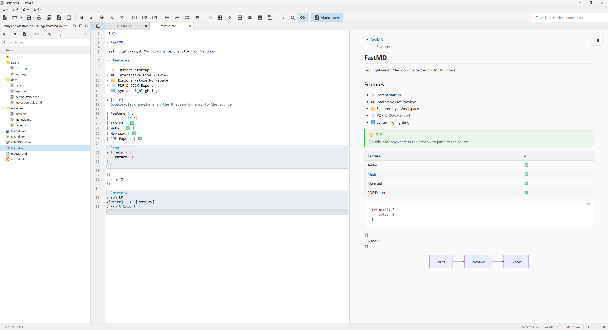

# FastMD: The Lightning-Fast, Native Markdown Text Editor

[](https://github.com/)
[](https://microsoft.com/windows)
[](https://apps.microsoft.com/detail/9n4dsd4wnz9d)


**FastMD** is an ultra-fast, native, and distraction-free Markdown Text Editor. It is currently available on Windows. Built from the ground up with **C++20** and **Qt 6 Widgets**, FastMD focuses on one thing: providing the absolute best typing performance and a frictionless writing experience.

If you are tired of sluggish, memory-heavy Electron apps and want a Markdown Text Editor that launches instantly and respects your system resources, FastMD is built for you.

## 🚀 The FastMD Philosophy: Speed Over Bloat

We believe that your writing tool should stay out of your way. Our core philosophy is simple:
**Speed > Simplicity > Stability > Maintainability > Features.**

To guarantee that typing performance remains inviolable, FastMD relies on strict architectural boundaries. **You will never see the following in FastMD:**

- ❌ Electron, Node.js, or a **bundled** Chromium/browser engine
- ❌ Qt WebEngine (which would embed Chromium into the app)
- ❌ Heavy Database backends (SQLite)
- ❌ Bloated Project Explorers or Sidebars
- ❌ Cloud sync, AI features, or plugins

The editor, UI, and startup path are 100% native C++/Qt. The Markdown **preview**
is rendered by the **Evergreen Microsoft Edge WebView2 runtime** — the browser
engine that already ships with Windows. Nothing is bundled: no Chromium is shipped,
the executable stays tiny, and the WebView2 process is created lazily and
asynchronously *after* the window is already on screen, so startup stays instant.

Just you, your words, and blistering fast performance.

## ✨ Key Features

### 🎯 Core Capabilities

- **Markdown Text Editor:** Full CommonMark support with syntax highlighting
- **Plain Text Mode:** Edit plain text files (.txt, .log, .csv, etc.) with dedicated mode
- **Live Preview:** Real-time Markdown preview side-by-side with the editor, rendered by the Microsoft Edge WebView2 runtime (browser-grade CSS, tables, task lists, and inline HTML)
- **Offline LaTeX Math:** Inline and display math typeset with bundled KaTeX — no internet required
- **Code Syntax Highlighting:** Fenced code blocks highlighted in the preview via bundled highlight.js
- **Mermaid Diagrams:** ` ```mermaid ` fenced blocks render as diagrams (flowcharts, sequence, class, state, ER, Gantt, pie, git graph, journey, mindmap, timeline, quadrant, requirement) — bundled and fully offline, with a click-to-zoom diagram viewer
- **Tables:** Insert custom-sized tables from the toolbar using a quick grid picker
- **HTML & PDF Export:** Generate clean, self-contained HTML or beautifully formatted PDFs with smarter filename defaults
- **Workspace Tree:** Browse and open files from your project folder
- **Session Restore:** Automatically restore previous session on startup
- **File Type Association:** Associate supported file types with FastMD
- **Check for Updates:** Stay up-to-date with built-in GitHub release checker
- **Preferences:** Customize editor behavior and startup settings

### 📊 By The Numbers (FastMD vs. Electron)

While Electron editors **bundle** an entire Chromium browser plus a Node.js runtime into every app, FastMD ships neither. The editor is native C++/Qt, and the preview reuses the **shared** Edge WebView2 runtime already present on Windows (created on demand, off the startup path). Here is a rough comparison of what that means for your system:

| Metric                   | Typical Electron Editor | FastMD (C++ / Qt)          | Difference    |
| ------------------------ | ----------------------- | -------------------------- | ------------- |
| **Base Executable Size** | 100 MB – 150 MB         | **~2 MB** (no bundled browser) | ~50x+ smaller |
| **Chromium shipped**     | Yes (per app)           | **No** (shared OS runtime) | —             |
| **Cold Startup (window visible)** | 2.0s – 4.0s    | **~0.4–0.5s**              | ~5–8x faster  |
| **Idle RAM Usage**       | 500 MB – 1000 MB        | **~250 MB** (incl. shared WebView2 preview) | ~2–4x lighter |

_Numbers are approximate. FastMD's RAM figure is the whole process tree including the WebView2 preview processes; the native editor core alone is far smaller, and no WebView2 is created until the preview is first shown._

### ⚡ Native Performance & Low Memory Footprint

By leveraging native **C++20** and the **Qt 6 Widgets** framework (rather than QML or Qt WebEngine), FastMD achieves near-instant startup times. The window appears and is fully interactive before the WebView2 preview engine is even initialized — WebView2 is created asynchronously in the background, so it never blocks the editor or startup.

### 📝 Blazing Fast Markdown Parsing

FastMD utilizes the [MD4C](https://github.com/mity/md4c) parser—a highly optimized, CommonMark-compliant C library. Whether you're opening a 10-line note or a 10,000-line manuscript, rendering is instantaneous. Features like tables, strikethroughs, and tasklists are fully supported out of the box.

### 🖨️ Seamless HTML & PDF Export

Exports are regenerated from your raw Markdown through the same MD4C + KaTeX pipeline the preview uses, so what you see closely matches what you export.

- **PDF Export:** Configurable page sizes, margins, fonts, and automatic image scaling.
- **HTML Export:** Clean, self-contained output perfect for publishing.

### 🎨 Clean, Distraction-Free UI

- **Light & Dark Themes:** Beautifully crafted, high-contrast themes that switch instantly.
- **Material Icons Toolbar:** A crisp, Notepad++ style lightweight toolbar utilizing embedded Material Icons.
- **Tabbed Interface:** Effortlessly manage multiple files with an intuitive tabbed workspace.

## Command line (Microsoft Store)

The installation from Microsoft Store registers the `fastmd` App Execution Alias. After installing it,
launch FastMD from Command Prompt, PowerShell, or Windows Terminal:

```bat
fastmd
fastmd .
fastmd README.md
fastmd file1.md file2.md
fastmd C:\Project
fastmd . file.md
fastmd *.md
```

Files open as tabs in the existing FastMD window. Folder arguments set the
Workspace root; when a folder and files are supplied together, the supplied
folder remains the Workspace root. Wildcards are expanded by FastMD, so they
also work in Command Prompt, which does not expand them itself.

## 📥 Downloads & Installation

- **Microsoft Store:** Get FastMD on the <a href="https://apps.microsoft.com/store/detail/9N4DSD4WNZ9D?cid=DevShareMCLPCS" target="_blank" rel="noopener">Microsoft Store</a>.
- **Windows Installer:** <a href="FastMD-Setup-Latest.exe" target="_blank" rel="noopener">FastMD-Setup-2.5.2.exe</a> — Standard Windows setup installer package included directly in this repository.
- **Portable Version:** <a href="FastMD-Portable.zip" target="_blank" rel="noopener">FastMD-Portable.zip</a> — Standalone portable archive (no installation required) included directly in this repository.

## ℹ️ About This Repository

This repository contains the official website pages (GitHub Pages), terms of service, privacy policy, and open-source license documentation for **FastMD**.

> **Note:** The source code for FastMD is closed-source / proprietary.

## 📜 License

See `licenses.html` for third-party open-source component licenses utilized by FastMD.

---

_Stop waiting on your editor. Start writing with FastMD._
